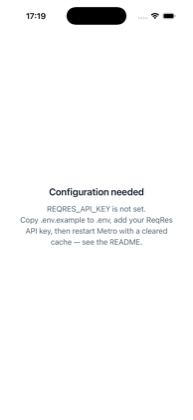
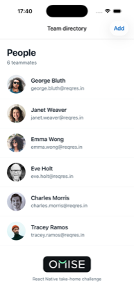
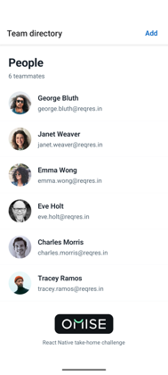
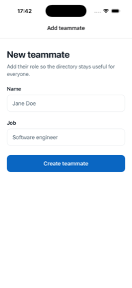
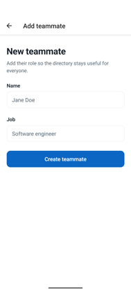

# Team Directory

React Native implementation of the [Team Directory take-home challenge](./CHALLENGE.md).

## Prerequisites

- Node.js 22.11 or later and npm
- Xcode and CocoaPods for iOS
- JDK 17 and the Android SDK for Android

## Setup

```sh
npm install
cp .env.example .env
cd ios && bundle exec pod install && cd ..
```

Set `REQRES_API_KEY` in `.env` to a valid ReqRes API key. `API_BASE_URL` is preconfigured for ReqRes. Environment values bundled into a client app are not secret storage; do not put credentials that must remain private in `.env`.

The values are inlined at build time, so the app names anything still unset instead
of failing on its first request. Seeing this screen means `.env` needs attention and
Metro needs restarting with `--reset-cache`:



### Android environment

Most setups need nothing here — Android Studio ships its own JDK and writes
`android/local.properties` for you.

If `java -version` reports `Unable to locate a Java Runtime`, a JDK is installed but
not on `PATH`, and Gradle fails before the build starts. A Homebrew `openjdk@17`
causes exactly this: it is keg-only, so it is never symlinked onto `PATH`.

```sh
export JAVA_HOME=$(/usr/libexec/java_home -v 17 2>/dev/null || brew --prefix openjdk@17)
export ANDROID_HOME="$HOME/Library/Android/sdk"
export PATH="$JAVA_HOME/bin:$ANDROID_HOME/platform-tools:$PATH"
```

`brew --prefix` resolves on both Apple Silicon and Intel. Add the exports to your
shell profile to make them permanent. As an alternative to `ANDROID_HOME`, create
`android/local.properties` (git-ignored) containing `sdk.dir=/path/to/Android/sdk`.

## Run

Start Metro in one terminal:

```sh
npm start
```

Then, in another terminal, launch a target:

```sh
npm run ios
npm run android
```

Verified on an iPhone 17 Pro simulator (iOS 26.5, Xcode 26.6) and on a
`TeamDirectory_API_36` Android emulator (API 36, JDK 17.0.20). On both targets the
list, detail, and add-teammate screens were exercised against the live ReqRes API,
along with the error and validation states. Dark appearance was additionally checked
on iOS.

## Screens

Captured from the runs described above, against the live ReqRes API.

| | iOS | Android |
| --- | --- | --- |
| **List** |  |  |
| **Detail** |  |  |
| **Add teammate** |  |  |

Loading, empty, error, and validation states are exercised by the test suite rather
than captured here.

## Checks

```sh
npm test -- --runInBand
npm run lint
npx tsc --noEmit
```

## Omise wordmark

The Omise wordmark appears **in the footer of the team list screen**, below the last
teammate, captioned "React Native take-home challenge" so it reads as attribution for
the exercise rather than a claim of affiliation.

The asset is derived from the official wordmark SVG linked in `CHALLENGE.md`
(`677d43728a9133b4cb493fd4_Logo.svg`) and rasterised to `@1x/@2x/@3x` PNGs in
`src/assets/`, which keeps the app free of an SVG rendering dependency. The mark is
drawn in white with the mint `#80FFBF` smile, so it ships on the brand's dark surface
instead of being recoloured — that keeps the official colours intact and legible in both
light and dark appearance.

## Assumptions and trade-offs

- Only page 1 of `/users` is fetched, per the brief. No pagination or pull-to-refresh.
- `POST /users` does not persist on ReqRes, so the form confirms success and clears
  itself rather than inserting into the list or invalidating the query cache.
- The API key ships in the client bundle via `.env`. That is not secret storage; it is
  only kept out of version control.
- Theme colours are plain light/dark palettes selected by `useColorScheme` rather than a
  full design-token system, which would be more machinery than three screens justify.
- Avatars fall back to the teammate's initials when the remote image fails to load.
- Screens are covered by behavioural unit tests over the render tree rather than
  snapshots, so the tests assert accessible names and state transitions instead of
  freezing layout.
